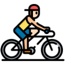

# Inference Reasoning for [Capture24](https://github.com/OxWearables/capture24) Dataset (GPT4)

You can copy the following prompts and try to figure out the HAR category for the given input.

## 1. Walking Case


1.1) **Instruction**

```
You are an expert on analyzing human activities based on IMU recordings.
```

1.2) **Content**

```
The normalized IMU data is collected from a watch attached to the user‘s wrist with a sampling rate of 10Hz. The IMU data is given in the IMU coordinate frame. The three-axis accelerations are given below:
1. x-axis: [0.4  0.5  0.78 1.04 0.81 0.24 0.57 0.83 0.89 0.75 0.37 0.45 0.78 1.01 0.81 0.24 0.5  0.78 0.86 0.73 0.43 0.57 0.89 0.85 0.73 0.51 0.54 1.01 1.2  0.85 0.53 0.75 0.99 0.89 0.89 0.43 0.61 0.93 1.01 1.02 0.53 0.69 1.07 1.2  1.01 0.86 0.67 0.94 1.39 0.88 0.77 0.8  0.51 1.28 1.26 0.81 0.24 1.04 0.96 1.02 0.75 0.61 0.93 1.32 1.32 0.81 0.18 0.51 0.7  0.69 0.85 0.24 0.67 1.01 1.23 0.83 0.51 0.5  1.05 1.04 0.67 0.34 0.42 1.23 1.24 0.56 0.11 0.8  1.21 1.01 0.81 0.26 0.64 1.01 1.15 0.62 0.19 0.67 1.15 0.93]
2. y-axis: [-0.22 -0.22 -0.23 -0.29 -0.32 -0.28 -0.46 -0.43 -0.31 -0.2  -0.25 -0.26 -0.29 -0.4  -0.28 -0.25 -0.43 -0.49 -0.37 -0.29 -0.17 -0.39 -0.4  -0.25 -0.28 -0.37 -0.37 -0.39 -0.48 -0.28 -0.12 -0.29 -0.36 -0.2  -0.34 -0.49 -0.4  -0.42 -0.37 -0.28 -0.25 -0.22 -0.45 -0.14 -0.12 -0.23 -0.31 -0.2 -0.25 -0.   -0.   -0.05 -0.46  0.04  0.11 -0.48 -0.31 -0.06  0.01  0.06 -0.08 -0.05 -0.08  0.12  0.27 -0.43 -0.6  -0.6  -0.51 -0.59 -0.31 -0.25 -0.4  -0.79 -0.34 -0.57 -0.34 -0.52 -0.59 -0.65 -0.32 -0.28 -0.65 -0.94 -0.74 -0.6  -0.48 -0.56 -0.69 -0.72 -0.56 -0.19 -0.56 -0.88 -0.43 -0.51 -0.37 -0.52 -0.89 -0.52]
3. z-axis: [-0.42 -0.58 -0.84 -1.15 -0.84 -0.36 -0.64 -1.07 -1.14 -0.77 -0.41 -0.64 -0.95 -1.07 -0.9  -0.31 -0.45 -0.96 -1.11 -0.77 -0.33 -0.55 -0.82 -0.88 -0.82 -0.44 -0.5  -0.68 -0.84 -0.8  -0.33 -0.47 -0.72 -0.79 -0.57 -0.31 -0.36 -0.63 -0.8  -0.52 -0.23 -0.34 -0.58 -0.28 -0.29 -0.14 -0.15 -0.2 -0.53 -0.8  -0.41 -0.61  0.39 -0.88 -0.58 -0.47 -0.17 -0.53 -0.76 -0.58  0.09 -0.02 -0.17 -0.39 -0.28 -0.44 -0.12 -0.17  0.17 -0.44 -0.07  0.06  0.23  0.45  0.26  0.15  0.1   0.31  0.69  0.18  0.33  0.02  0.01  0.09 -0.14  0.01  0.01  0.14  0.44 -0.23  0.07  0.07  0.18  0.23  0.1   0.14  0.01  0.33  0.47 -0.02]
The person's action belongs to one of the following categories: [sit-stand, sleep, walking, bicycling].
Could you please tell what action the person was doing based on the given information and IMU readings? Please make an analysis step by step.
```

1.3) **Answer**
    
```
Analyzing human activities from IMU (Inertial Measurement Unit) recordings involves understanding the patterns in acceleration data across three axes (x, y, z) to classify the type of activity being performed. Given the data and the options (sit-stand, sleep, walking, bicycling), let's analyze the characteristics of each activity and match them with the provided IMU data.

### Step 1: Understanding Activity Patterns

1. **Sit-Stand**: This activity involves a significant change in the z-axis as the person moves vertically, with relatively minor changes in the x and y axes unless the person shifts position while sitting or standing.
2. **Sleep**: During sleep, the accelerometer data would show very low variability, indicating minimal movement. Any movements would be slight and infrequent.
3. **Walking**: Walking involves periodic, recognizable patterns in all three axes due to the body's forward motion and the alternating movement of the legs and arms. The x-axis would show forward motion, the y-axis would show side-to-side swaying, and the z-axis would reflect the up-and-down movement.
4. **Bicycling**: Bicycling would show less variability in the z-axis compared to walking because the body is supported by the bicycle. However, there would be significant periodic patterns in the x-axis due to pedaling and forward motion, and some activity in the y-axis due to balancing and steering.

### Step 2: Analyzing the Given Data

1. **X-Axis Patterns**: The x-axis data shows significant variability and periodic peaks, suggesting that the activity involves consistent forward motion or repetitive movement.
2. **Y-Axis Patterns**: The y-axis data shows variability but with less amplitude compared to the x-axis. This indicates some side-to-side movement or periodic adjustments, which could be seen in activities like walking or bicycling.
3. **Z-Axis Patterns**: The z-axis also shows variability with periodic dips and returns to baseline. This suggests vertical movement, which could be present in walking or the slight up-and-down movements in bicycling.

### Step 3: Matching Data with Activities

1. **Sit-Stand**: The consistent variability across all axes does not match the expected pattern for sit-stand, which would show more pronounced changes in the z-axis with less continuous movement.
2. **Sleep**: The data shows too much variability and periodicity for sleep, indicating that the person is engaged in more active movement.
3. **Walking**: The periodicity and the presence of variability across all three axes strongly suggest walking. Walking would show patterns due to the cyclic nature of steps, which is consistent with the observed data.
4. **Bicycling**: While bicycling could explain the forward motion indicated by the x-axis and the balancing movements seen in the y-axis, the z-axis variability is less characteristic of bicycling, which typically shows smoother z-axis data due to the support of the bicycle.

### Conclusion

Based on the step-by-step analysis of the IMU data characteristics and comparing them with the expected patterns of the given activities, the most likely activity being performed is **walking**. This conclusion is drawn from the significant variability and periodic patterns observed across all three axes, which align closely with the expected motion dynamics of walking.
```

## 2. Sleep Case


2.1) **Instruction**

```
You are an expert on analyzing human activities based on IMU recordings.
```

2.2) **Content**

```
The normalized IMU data is collected from a watch attached to the user‘s wrist with a sampling rate of 10Hz. The IMU data is given in the IMU coordinate frame. The three-axis accelerations are given below:
1. x-axis: [0.19 0.17 0.19 0.19 0.19 0.19 0.19 0.19 0.19 0.17 0.19 0.19 0.19 0.19 0.19 0.19 0.19 0.19 0.19 0.19 0.19 0.19 0.19 0.19 0.19 0.19 0.19 0.19 0.19 0.17 0.19 0.19 0.19 0.19 0.17 0.19 0.17 0.19 0.17 0.17 0.17 0.19 0.19 0.17 0.19 0.19 0.19 0.19 0.19 0.17 0.17 0.17 0.17 0.17 0.19 0.19 0.17 0.19 0.19 0.19 0.19 0.19 0.19 0.19 0.19 0.19 0.19 0.19 0.19 0.19 0.17 0.19 0.19 0.19 0.19 0.19 0.19 0.19 0.19 0.19 0.19 0.19 0.17 0.19 0.19 0.19 0.19 0.19 0.19 0.19 0.17 0.19 0.19 0.19 0.19 0.17 0.19 0.17 0.19 0.19]
2. y-axis: [-0.2  -0.2  -0.2  -0.2  -0.2  -0.2  -0.19 -0.2  -0.2  -0.2  -0.2  -0.2 -0.2  -0.2  -0.2  -0.2  -0.2  -0.2  -0.2  -0.2  -0.2  -0.2  -0.2  -0.2 -0.2  -0.2  -0.2  -0.2  -0.2  -0.2  -0.2  -0.2  -0.2  -0.2  -0.2  -0.2 -0.2  -0.2  -0.2  -0.2  -0.2  -0.2  -0.2  -0.2  -0.2  -0.2  -0.2  -0.2 -0.2  -0.2  -0.2  -0.2  -0.2  -0.2  -0.2  -0.2  -0.2  -0.2  -0.2  -0.2 -0.2  -0.2  -0.2  -0.2  -0.2  -0.2  -0.2  -0.2  -0.2  -0.2  -0.2  -0.2 -0.2  -0.2  -0.2  -0.2  -0.2  -0.2  -0.2  -0.2  -0.2  -0.2  -0.2  -0.2 -0.2  -0.2  -0.2  -0.2  -0.2  -0.2  -0.2  -0.2  -0.2  -0.2  -0.2  -0.2 -0.2  -0.2  -0.2  -0.2 ]
3. z-axis: [-0.96 -0.96 -0.96 -0.98 -0.96 -0.96 -0.96 -0.98 -0.96 -0.96 -0.96 -0.96 -0.96 -0.98 -0.96 -0.98 -0.98 -0.96 -0.98 -0.96 -0.96 -0.98 -0.96 -0.96 -0.96 -0.96 -0.96 -0.96 -0.96 -0.96 -0.98 -0.96 -0.96 -0.96 -0.96 -0.96 -0.96 -0.96 -0.96 -0.96 -0.96 -0.96 -0.96 -0.96 -0.96 -0.96 -0.96 -0.96 -0.96 -0.98 -0.96 -0.96 -0.96 -0.96 -0.98 -0.96 -0.96 -0.96 -0.98 -0.96 -0.96 -0.96 -0.96 -0.96 -0.96 -0.96 -0.96 -0.96 -0.96 -0.96 -0.96 -0.96 -0.96 -0.96 -0.96 -0.96 -0.96 -0.96 -0.96 -0.96 -0.96 -0.96 -0.96 -0.96 -0.96 -0.96 -0.96 -0.96 -0.96 -0.96 -0.96 -0.98 -0.98 -0.96 -0.96 -0.96 -0.96 -0.96 -0.96 -0.96]
The person's action belongs to one of the following categories: [sit-stand, sleep, walking, bicycling].
Could you please tell what action the person was doing based on the given information and IMU readings? Please make an analysis step by step.
```

2.3) **Answer**
    
```
To analyze human activities based on the given IMU (Inertial Measurement Unit) recordings from a watch attached to the user's wrist and identify the action among the categories of sit-stand, sleep, walking, or bicycling, we'll go through the data step by step, examining the characteristics of the three-axis accelerations (x, y, z) and the implications for the user's activity.

### Understanding IMU Data

IMU sensors typically capture linear acceleration along three perpendicular axes (x, y, z) and angular velocity around these axes. The given data provides acceleration in these three dimensions with a sampling rate of 10Hz, meaning data is recorded ten times per second.

### Analyzing the Data

1. **X-axis Acceleration**:
    - The values are primarily around 0.19, with minor fluctuations. This suggests a relatively stable condition in the horizontal plane parallel to the ground, indicating steady motion or a stationary state without significant lateral movement.

2. **Y-axis Acceleration**:
    - The values are consistently around -0.2, indicating a stable condition without significant forward or backward movement. This steady reading suggests there is no significant acceleration or deceleration in the forward or backward direction.

3. **Z-axis Acceleration**:
    - The values fluctuate slightly around -0.96, with occasional readings at -0.98. This indicates a consistent downward force, likely due to gravity, with minimal vertical movement. The close value to -1g (where g ≈ 9.81 m/s^2) suggests that the device is mostly stationary in the vertical axis but might be subjected to minor vibrations or adjustments.

### Determining the Activity

Given the characteristics of the IMU data, let's analyze how they match the potential activities:

- **Sit-Stand**:
    - Involves significant vertical movement (z-axis) as one transitions from sitting to standing and vice versa. The data does not show significant fluctuations in the z-axis that would indicate such transitions.
    
- **Sleep**:
    - Characterized by minimal movement across all axes. The relatively stable readings, especially in the z-axis close to -1g, suggest minimal vertical movement, which is consistent with a person lying down. However, the slight variations observed might not be sufficient alone to confirm sleep unless these variations are within the range of normal breathing or minor adjustments during sleep.

- **Walking**:
    - Walking would introduce more variability in all three axes due to the cyclic nature of steps. The x and y axes would show fluctuations as the arms swing, and the z-axis would capture the impact of footfalls. The data does not exhibit the expected pattern or level of variability for walking.

- **Bicycling**:
    - Bicycling would show more consistent readings, similar to what is observed, due to the cyclical but smooth motion. However, one would expect more variation due to the motion of pedaling and possible changes in terrain. The lack of significant variability in the data makes bicycling a less likely option, especially considering the arm (wrist) would be relatively stationary holding onto the handlebars, but not completely without movement.

### Conclusion

Based on the analysis, **sleep** seems to be the most plausible activity, given the minimal movement across all axes and the consistency of the data, suggesting a state of rest. However, it's important to note that without more context or comparative data (e.g., data from periods of known activity for calibration), this analysis cannot be definitive. The slight variations observed could be due to minor adjustments in position or other factors not captured solely by the IMU data.
```

## 3. Sit-Stand Case


3.1) **Instruction**

```
You are an expert on analyzing human activities based on IMU recordings.
```

3.2) **Content**

```
The normalized IMU data is collected from a watch attached to the user‘s wrist with a sampling rate of 10Hz. The IMU data is given in the IMU coordinate frame. The three-axis accelerations are given below:
1. x-axis: [ 0.82  0.74  0.79  0.88  0.51  0.71  0.99  1.21  0.71  0.62  0.09 -0.19  1.02  0.    0.42  0.59  0.51  0.4   0.42  0.64  0.67  0.67  0.99  0.3  0.43  1.33  0.92  0.7   0.47  0.53  0.51  0.51  0.31  0.23  0.42  0.37  0.5   0.36  0.67  0.37  0.76  0.34  0.56  0.59  0.76  0.71  0.59  0.68  0.54  0.68  0.64  0.47  0.51  0.59  0.67  0.74  0.67  0.7   0.71  0.74  0.7   0.64  0.57  0.59  0.56  0.62  0.62  0.56  0.59  0.57  0.64  0.64  0.65  0.71  0.64  0.57  0.56  0.56  0.48  0.5   0.5   0.56  0.57  0.65  0.53  0.57  0.59  0.59  0.53  0.54  0.57  0.61  0.47  0.67  0.67  0.71  0.62  0.73  0.7   0.74]
2. y-axis: [-0.64 -0.56 -0.5  -0.73 -0.92 -0.33 -0.25 -0.68 -1.18 -0.68 -0.61 -1.01 -1.01 -0.96 -1.17 -0.86 -0.67 -0.81 -0.67 -0.79 -0.42 -0.53 -1.12  0.05 -0.37 -1.54 -0.98 -0.56 -0.56 -0.92 -0.76 -0.79 -0.65 -0.92 -0.9  -0.81 -0.72 -0.9  -0.75 -0.4  -0.65 -1.07 -0.7  -0.47 -0.82 -0.73 -0.79 -0.61 -1.01 -0.62 -0.64 -0.78 -0.93 -0.68 -0.65 -0.78 -0.65 -0.64 -0.62 -0.72 -0.7  -0.75 -0.64 -0.65 -0.72 -0.78 -0.86 -0.82 -0.78 -0.78 -0.75 -0.75 -0.73 -0.67 -0.78 -0.86 -0.82 -0.78 -0.79 -0.78 -0.81 -0.78 -0.75 -0.75 -0.81 -0.79 -0.73 -0.73 -0.78 -0.84 -0.79 -0.76 -0.89 -0.67 -0.68 -0.65 -0.67 -0.67 -0.67 -0.59]
3. z-axis: [-0.28 -0.05 -0.19 -0.16  0.25 -0.06 -0.42 -0.19 -0.22  0.3   0.34  0.73  0.36  0.33  0.44  0.41  0.45  0.41  0.05  0.25  0.45  0.38  0.75 -0.3 -0.47 -0.86 -0.59 -0.2  -0.44 -0.47 -0.45 -0.42 -0.36 -0.36 -0.31 -0.5 -0.5  -0.48 -0.64 -0.3  -0.73 -0.42 -0.44 -0.2   0.08 -0.06 -0.12 -0.12 -0.44 -0.42 -0.19 -0.17 -0.19 -0.25 -0.2  -0.25 -0.26 -0.12 -0.34 -0.28 -0.3  -0.31 -0.33 -0.36 -0.34 -0.19 -0.19 -0.25 -0.28 -0.22 -0.2  -0.26 -0.22 -0.23 -0.23 -0.22 -0.25 -0.26 -0.26 -0.31 -0.26 -0.31 -0.26 -0.31 -0.33 -0.34 -0.25 -0.34 -0.34 -0.33 -0.31 -0.26 -0.23 -0.3  -0.26 -0.3 -0.28 -0.25 -0.3  -0.28]
The person's action belongs to one of the following categories: [sit-stand, sleep, walking, bicycling].
Could you please tell what action the person was doing based on the given information and IMU readings? Please make an analysis step by step.
```

3.3) **Answer**
    
```
To analyze the provided IMU data from a wristwatch and deduce the user's activity, we'll examine the acceleration patterns across the x, y, and z axes and compare them to the typical signatures of sit-stand, sleep, walking, and bicycling activities.

### Step 1: Characterizing the Activities

1. **Sit-Stand:** Characterized by significant vertical movements, reflected in the z-axis, with minimal consistent movement in the x and y axes.
   
2. **Sleep:** Exhibits very low variability across all axes, indicative of minimal movement, with occasional spikes when the person changes position.

3. **Walking:** Shows rhythmic, periodic patterns in all three axes due to the cyclical nature of stepping forward and the body's response to each step's impact.

4. **Bicycling:** Typically presents smoother patterns than walking, especially in the z-axis, due to the seated, less impactful nature of the activity. The x and y axes may show more consistent, less variable movements.

### Step 2: Analyzing the Data

- **X-axis:** The data shows significant variability with values ranging from positive to negative, suggesting varied forward and backward movements. Notable peaks (e.g., 1.33) indicate moments of more intense activity.

- **Y-axis:** There's notable variability, with values mostly negative, indicating lateral movements or shifts in orientation. The presence of very negative values (e.g., -1.54) suggests significant lateral movement at times.

- **Z-axis:** The z-axis also shows variability, with values fluctuating between positive and negative. This indicates up-and-down movements, but the pattern doesn't consistently suggest high-impact activity like running.

### Step 3: Interpreting the Data

- The **x-axis** data suggests a range of activities with no clear rhythmic pattern, which might exclude consistent cyclical activities like walking or bicycling.

- The **y-axis** shows significant lateral movement, which could indicate activities involving side-to-side motion or changes in body orientation.

- The **z-axis** indicates vertical movement but without the consistent high peaks that might be expected from activities with a strong vertical component like walking or running.

### Conclusion

Considering the patterns across all axes, especially the significant lateral movements reflected in the y-axis and the variability in the x and z axes, the data suggests the user might have been engaged in an activity that involves varied movements without a consistent cyclical pattern. The activity could involve a mix of motions or transitions between different types of movements, possibly including **sit-stand** activities or other movements that involve changes in body orientation and position. The data doesn't clearly fit the consistent patterns of walking or bicycling, nor does it suggest the minimal movement associated with sleep.
```

## 4. Bicycle Case


4.1) **Instruction**

```
You are an expert on analyzing human activities based on IMU recordings.
```

4.2) **Content**

```
The normalized IMU data is collected from a watch attached to the user‘s wrist with a sampling rate of 10Hz. The IMU data is given in the IMU coordinate frame. The three-axis accelerations are given below:Please make an analysis step by step, and please do not use code script.
1. x-axis: [-0.32 -0.71 -1.36 -1.41 -0.58 -0.58 -0.49 -0.18 -0.26 -0.38 -0.48 -0.04 -0.9   0.02 -0.41 -0.32 -0.62 -0.26 -0.74 -0.29 -0.13 -0.1  -0.34 -0.55 -0.2  -0.87 -0.01  0.05 -0.58 -0.02 -0.49 -0.48 -0.27 -0.54 -0.4  -0.4 -0.27 -0.24 -0.44 -0.23 -0.55 -0.21 -0.38 -0.32 -0.29 -0.32 -0.04 -0.52 -0.44 -0.24 -0.32 -0.43 -0.21 -0.49 -0.13 -0.37 -0.27  0.09 -0.4  -0.38 -0.24 -0.18 -0.38 -0.21  0.1  -0.43 -0.09  0.02 -0.24 -0.06 -0.16  0.01 -0.54 -0.04 -0.38 -0.13 -0.35 -0.13 -0.27 -0.2  -0.01 -0.66 -0.24 -0.21 -0.18 -0.2   0.01 -0.34 -0.62 -0.13 -0.07 -0.18 -0.48 -0.18 -0.38 -0.23 -0.12 -0.51 -0.09 -0.38]
2. y-axis: [ 0.49  0.25 -0.11 -0.17 -0.28 -0.42 -0.56 -0.75 -0.58 -0.34 -1.22 -0.72  1.08 -0.25 -1.56 -0.26 -0.2  -0.59 -0.97 -0.53  0.69 -0.54 -0.29 -2.56 -1.98 -0.59  0.02 -1.31 -1.22  0.38 -0.58 -1.62 -0.58 -0.22 -0.23 -1.56 -0.82 -1.04 -0.73 -0.45 -0.65 -0.53 -0.54 -0.08 -0.47 -1.04 -0.5  -0.61 -1.06 -0.84 -0.5  -1.29 -0.39  0.03 -0.12 -1.12 -0.95 -0.9  -1.   -1.48 -1.34 -1.2   0.56 -0.08 -0.56 -0.56 -0.09 -1.61 -0.97 -0.54 -1.04 -1.04 -0.92 -0.56 -0.76 -0.36 -1.14 -0.42 -0.03 -1.56 -0.92 -1.78 -0.58 -1.11 -0.34  0.17  0.7  -0.42 -0.81 -1.73 -0.67 -0.65 -0.84 -0.47 -0.67 -0.75  0.11 -0.59 -0.98 -0.73]
3. z-axis: [ 0.33  0.18  0.18  0.38  0.81  0.8   1.    0.86  0.63  0.66  0.75  0.47  1.46  0.64  0.03  0.61  1.29  0.69  1.24  0.63  0.76  1.1   0.23  1.5  0.32  1.12  0.63  0.09  0.63  0.96  0.83  0.38  0.8   1.12  0.73  0.93  0.36  0.8   0.75  0.72  0.95  0.66  0.55  0.56  0.89  0.49  0.26  1.21  1.04  0.76  0.81  0.8   0.83  1.1   0.53  1.13  0.66  0.49  0.63  0.66  0.56  0.87  0.84  1.37  0.29  0.58  0.58  0.76  0.58  0.53  0.61  0.38  1.16  0.64  0.89  0.73  1.12  0.61  0.4   0.64  0.29  1.16  0.5   0.64  0.26  0.84 -0.17  0.78  0.81  1.35  0.07  0.29  0.86  0.81  1.09  0.89  0.76  1.47  0.2   0.4 ]
The person's action belongs to one of the following categories: [sit-stand, sleep, walking, bicycling].
Could you please tell what action the person was doing based on the given information and IMU readings? Please make an analysis step by step.
```

4.3) **Answer**
    
```
Analyzing IMU data to understand human activity involves examining the patterns and magnitudes of the three-axis accelerations. Let's analyze the given IMU data step by step to deduce the person's activity from the categories of sit-stand, sleep, walking, or bicycling.

### Step 1: Overview of IMU Data

- The data is collected at a 10Hz sampling rate, which means we have 10 data points per second, providing detailed insight into the activity's dynamics.
- The data spans three axes (x, y, z), which represent acceleration in those directions. This three-dimensional perspective is crucial for understanding complex human movements.

### Step 2: Analyzing Patterns in Each Axis

1. **X-axis (lateral movement):** The values fluctuate around zero with no significant peaks, suggesting there's not a lot of side-to-side movement. This pattern could be present in all listed activities but is less indicative of bicycling, which usually involves more stable lateral acceleration unless turning.

2. **Y-axis (forward and backward movement):** There are significant negative values, suggesting forward movement or forward lean with occasional high peaks. The presence of values such as -2.56 indicates strong forward or backward movements at times. This pattern could suggest activities like walking or bicycling, which involve forward motion, whereas sleep and sit-stand transitions are less likely to produce such varied y-axis acceleration.

3. **Z-axis (vertical movement):** The values here show a mix of moderate to high positive accelerations. This suggests vertical movement or vibration, common in activities like walking or bicycling, due to the up-and-down or bumpy nature of these activities. Sleep would show minimal z-axis variation, and sit-stand transitions would show a more uniform pattern of increase or decrease.

### Step 3: Deductive Analysis Based on Patterns

- **Sit-Stand:** This activity would likely show a clear pattern of acceleration changes in the z-axis as the person transitions from sitting to standing or vice versa, with minimal sustained y-axis or x-axis movements. The data does not consistently suggest this pattern.
  
- **Sleep:** During sleep, especially if the person is relatively still, we would expect very low variability in all axes. The significant fluctuations observed, especially in the y-axis and z-axis, argue against sleep.

- **Walking:** Walking is characterized by repetitive, cyclic patterns of acceleration in all axes due to the gait cycle. The z-axis shows a consistent pattern that could be indicative of walking, with the vertical movement associated with each step. The y-axis variability could also correspond to the forward propulsion of walking, but the y-axis accelerations seem somewhat high for regular walking.

- **Bicycling:** Bicycling involves consistent forward motion, reflected in the y-axis, and periodic up-and-down motion from pedaling, which could be seen in the z-axis data. The high variability in the y-axis and significant peaks might suggest moments of increased effort or speed changes, which are common in bicycling. The x-axis shows relatively low variability, which aligns with the lateral stability needed when bicycling.

### Conclusion

Given the data analysis:
- The significant forward/backward movements indicated by the y-axis data, combined with the vertical movements shown in the z-axis, suggest an activity involving forward motion and periodic vertical displacement.
- The x-axis data suggests some lateral stability.

The most likely activity, considering the combination of these patterns, seems to be **bicycling**. Bicycling uniquely matches the pattern of significant forward motion with periodic vertical movement and lateral stability. Walking is also a possibility but is less likely due to the high variability and magnitude of accelerations on the y-axis, which are more characteristic of bicycling efforts, such as pedaling against resistance or acceleration.
```

## 5. Suggestion

You can replace the IMU data with your own and try to analyze the human activity based on the given information and IMU readings.