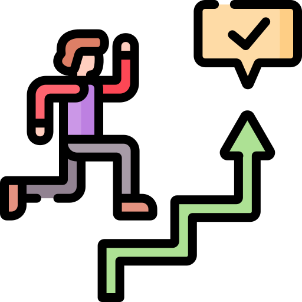

# Inference Reasoning for [HHAR](https://archive.ics.uci.edu/dataset/344/heterogeneity+activity+recognition) Dataset (GPT4)

You can copy the following prompts and try to figure out the HAR category for the given input.

## 1. Upstairs


1.1) **Instruction**

```
You are an expert on analyzing human activities based on IMU recordings.
```

1.2) **content**

```
The IMU data is collected from a mobile phone attached to the user's body with a sampling rate of 10Hz. The IMU data is given in the IMU coordinate frame.The three-axis accelerations recording is given below.
1. x-axis: [-0.32 -2.27 -1.77 -1.14 -1.12 -0.63 -0.53 -0.6  -1.05 -3.01 -3.78 -3.2 -3.   -2.14 -2.11 -1.74 -2.75 -4.57 -2.9  -2.65 -2.37 -1.89 -0.76 -4.22 -4.38 -2.76 -2.65 -1.71 -1.59 -1.7  -3.99 -3.73 -2.77 -2.23 -1.66 -1.41 -3.24 -4.81 -3.44 -2.76 -2.09 -2.02 -1.06 -4.01 -4.49 -3.16 -2.21 -2.04 -1.48 -0.2  -4.67 -4.84 -2.84 -2.31 -1.95 -1.67 -1.14 -5.12 -3.71 -3.07]
2. y-axis: [ 0.68 -0.05 -2.41 -0.75 -1.41 -1.34 -1.99 -1.42 -2.95 -0.79  0.25  0.67  1.14  0.29  1.1   1.55  0.13  0.88 -1.12 -1.18 -0.49 -0.62 -2.04 -0.9  0.78  0.88  0.26  0.38  2.17  0.43 -0.11 -0.73 -1.47 -0.24 -1.12 -1.92 -1.49 -0.24  0.51  0.56  0.06  1.63  1.3   0.26 -0.22 -1.45 -0.52 -0.62 -2.05 -1.41 -0.65  0.55  0.64 -0.27  1.1   1.69  0.23 -0.12 -0.49 -1.81]
3. z-axis: [ 9.38 11.43 10.59  9.86 10.18  9.68  9.57  9.55 11.54 14.91  8.69 10.44  8.11  8.13  8.39 10.65 12.09  9.35 10.53  8.5   7.49  8.29 11.58 13.41 10.86  9.1   7.15  7.42 10.35 12.51 10.75 10.08  8.83  6.29  8.72 11.62 11.95 10.74  9.82  8.85  7.39  8.23 11.65 12.81  9.55 10.2   8.1   6.93  9.23 12.5  12.09 10.6  10.23  7.87  6.98 10.   11.31 10.77  9.79  9.87]
The three-axis angular velocities recording is given below.
1. x-axis: [ 0.1   0.35 -0.19  0.   -0.08 -0.12  0.11  0.28  0.39  0.37  0.72  0.41  0.17  0.16  0.21 -0.15 -0.14 -0.22 -0.34 -0.16 -0.15 -0.18 -0.04  0.06  0.5   0.27  0.18  0.14  0.09 -0.33 -0.44 -0.32 -0.27 -0.23 -0.28  0.  0.36  0.54  0.21  0.15  0.31  0.13 -0.14 -0.21 -0.46 -0.2  -0.17 -0.24 -0.28  0.07  0.47  0.39  0.2   0.19  0.31  0.15 -0.18 -0.3  -0.37 -0.22]
2. y-axis: [-0.57 -0.04  0.13  0.18  0.42  0.24  0.21  0.19  0.25  0.17  0.07  0.19 -0.07  0.03 -0.    0.09 -0.29 -0.18  0.17 -0.08  0.2   0.18  0.11 -0.03  0.02 -0.22 -0.1   0.3   0.25 -0.24 -0.28  0.12 -0.09  0.14  0.32  0.09 -0.19 -0.12 -0.05 -0.1  -0.04  0.25  0.12 -0.02 -0.12 -0.06 -0.11  0.16  0.34  0.05 -0.18 -0.03 -0.17 -0.09  0.26  0.46 -0.19 -0.21  0.11  0.03]
3. z-axis: [-1.72 -0.92 -1.21 -1.49 -1.36 -1.04 -0.82 -0.44 -0.19 -0.   -0.49 -0.61 -0.32 -0.31 -0.4  -0.05 -0.18 -0.38  0.03 -0.35 -0.42 -0.05  0.15 -0.01  0.05  0.3   0.43  0.25  0.25  0.17 -0.09  0.03 -0.21 -0.19 -0.02 -0.13 -0.18 -0.05  0.12  0.33  0.18  0.21  0.36 -0.09 -0.21 -0.22 -0.3   0.03  0.03 -0.16 -0.11  0.06  0.36  0.29  0.09  0.21  0.04 -0.41 -0.16 -0.42]
The person's action belongs to one of the following categories: [downstairs, upstairs].
Could you please tell what action the person was doing based on the given information and IMU readings?Please make an analysis step by step.
```

1.3) **Answer**

```
To analyze the human activity based on the provided IMU (Inertial Measurement Unit) recordings from a mobile phone, we'll need to consider the characteristics of the two potential actions: walking downstairs and walking upstairs. These activities have distinct patterns in terms of acceleration and angular velocity, which can be observed in the x, y, and z axes.

### Step 1: Understand the IMU Data
- **Accelerations**: Represent changes in velocity along the three axes. 
  - X-axis: Forward/backward motion
  - Y-axis: Sideways motion
  - Z-axis: Upward/downward motion
- **Angular Velocities**: Represent the rate of rotation around the three axes.
  - X-axis: Roll (tilting side to side)
  - Y-axis: Pitch (tilting forward and backward)
  - Z-axis: Yaw (turning left and right)

### Step 2: Analyze Acceleration Patterns
- **Walking Downstairs**:
  - X-axis: Might show less intense forward/backward movements compared to walking upstairs, as the person controls their descent.
  - Y-axis: Might show more variability as the person might need to balance more side-to-side.
  - Z-axis: Likely shows periodic drops in acceleration with each step down, as each step involves a controlled fall.

- **Walking Upstairs**:
  - X-axis: Likely to show more intense forward/backward movements as the person pushes forward and upward.
  - Y-axis: Might show less side-to-side movement compared to downstairs, as the motion is more forward and upward focused.
  - Z-axis: Likely shows spikes in acceleration as the person lifts their body upward with each step.

### Step 3: Analyze Angular Velocity Patterns
- **Walking Downstairs**:
  - Might show more variation in roll and pitch as the person balances and controls the descent.
  - Yaw might not be as significant unless the staircase requires turning.

- **Walking Upstairs**:
  - Might show less variation in roll and pitch compared to downstairs, as the motion is more straightforward.
  - Similar to downstairs, yaw might not be as significant unless turning is involved.

### Step 4: Apply Analysis to Provided Data
- **Acceleration Observations**:
  - X-axis shows significant fluctuations, suggesting considerable forward and backward movement.
  - Y-axis has variability, but without clear patterns to distinctly indicate upstairs or downstairs.
  - Z-axis shows consistent high values with periodic fluctuations, which might indicate the lifting motion associated with going upstairs.

- **Angular Velocity Observations**:
  - X-axis shows variations, but not clearly indicative of one action over the other.
  - Y-axis variations are present, which could correspond to either activity.
  - Z-axis shows variations with some periodic patterns, but again, not definitively indicative of one activity over the other.

### Conclusion:
Based on the provided IMU data:
- The **significant fluctuations on the X-axis** in accelerations suggest a lot of forward and backward movement, which is more characteristic of walking upstairs, where there's a significant component of pushing forward and up.
- The **Z-axis acceleration** showing consistent high values with periodic fluctuations suggests an upward lifting motion, again more indicative of walking upstairs.

Thus, the analysis leans towards the person performing the action of **walking upstairs**, although it's important to note that without comparing this data to a baseline or having more contextual information, this analysis is somewhat speculative. In practice, machine learning models trained on labeled datasets are often used to make these determinations with higher accuracy.
```

## 2. Downstairs


2.1) **Instruction**

```
You are an expert on analyzing human activities based on IMU recordings.
```

2.2) **content**

```
The IMU data is collected from a mobile phone attached to the user's body with a sampling rate of 10Hz. The IMU data is given in the IMU coordinate frame.The three-axis acceleration recording is given below.
1. x-axis: [-2.38  0.34 -1.48  0.14 -0.28 -0.3  -1.87 -1.95 -1.64 -0.52 -0.52 -0.19  0.64 -3.15 -1.89 -1.79 -0.73 -0.22 -0.14 -1.98 -2.25 -1.53 -0.25 -0.32  0.18  1.22 -0.15 -3.12 -0.94 -1.18  0.22 -0.09 -0.19 -4.08 -1.42 -1.05 -1.25 -0.67 -0.66  0.73  0.65 -2.23 -3.5  -2.34 -2.49 -1.49 -0.65 -0.12 -0.07 -0.87 -2.04 -1.99 -1.62 -1.2  -0.56  0.15 -0.24 -0.91 -0.28 -0.92]
2. y-axis: [-2.32 -1.35 -1.75 -0.41 -1.54 -1.66 -0.63  1.23  1.51  0.03  1.23  1.05  0.87 -1.6  -1.93 -1.65 -0.94 -1.03 -1.04 -2.12  1.26  1.69  0.56  0.91  0.17  1.17  0.34 -2.94  0.95 -1.59 -0.94  0.93 -0.6   0.53  1.01  0.54  1.54  0.87  1.2  -0.93  2.82  1.46 -1.79  0.99 -1.4  -0.8  -1.85 -1.03 -0.55 -1.54  0.24  2.08 -0.55  1.37  0.51 -0.46  1.91  1.24 -1.8  -1.43]
3. z-axis: [13.58 13.17  9.63  8.32  7.31  8.22 10.66 17.97 10.21  8.65  6.82  9.79  9.05 12.38 15.    9.82  8.92  8.1   6.13  9.26 18.07 12.1   9.69  7.09  8.57 10.   11.37 13.95 12.08  7.86  8.97 11.67 11.65  9.74 11.05  9.93  9.08  9.22  9.67 11.28 10.86 11.38 10.71  9.35  9.41 10.21  9.84 10.37  9.92 11.31 10.65  9.85 10.5   9.15  7.58  7.54  9.7  10.46 15.18 10.52]
The three-axis angular velocities recording is given below.
1. x-axis: [-0.11  0.01 -0.01  0.02  0.17  0.12 -0.04  0.09  0.23  0.08 -0.01 -0.33 -0.15 -0.09  0.04 -0.09 -0.02  0.05  0.08 -0.12  0.17  0.05 -0.07 -0.12 -0.39 -0.42  0.07  0.16 -0.14 -0.16  0.16  0.23 -0.02 -0.69  0.03 -0.1 -0.03 -0.2  -0.53 -0.32 -0.2   0.01 -0.18 -0.36 -0.41 -0.26 -0.31 -0.02  0.05  0.27 -0.29  0.    0.14  0.1  -0.08 -0.18 -0.17 -0.17  0.15 -0.08]
2. y-axis: [ 0.32 -0.36  0.02  0.05 -0.06 -0.06  0.07 -0.07  0.01  0.07  0.04 -0.01 -0.1   0.22  0.15 -0.04  0.22  0.04 -0.11  0.02 -0.27 -0.06 -0.04 -0.02  0.08 -0.2  -0.42  0.09 -0.42  0.23  0.45  0.21 -0.3  -0.35  0.37 -0.13 -0.   -0.01 -0.06  0.02 -0.23 -0.19  0.02 -0.17  0.01  0.08 -0.23 -0.19 -0.16 -0.14 -0.17  0.54 -0.09 -0.01 -0.09 -0.32 -0.29 -0.09 -0.06 -0.14]
3. z-axis: [ 0.43  0.01  0.02  0.22  0.08 -0.15 -0.28 -0.87 -0.25 -0.09 -0.03  0.36  0.54  0.69  0.39  0.04  0.07  0.14  0.16 -0.12 -0.99  0.01  0.34  0.39  0.7   1.17  1.16  0.55  0.75  1.22  0.62  0.71  1.2   0.86  1.39  1.11  1.19  1.09  1.23  0.63 -0.    1.15  1.16  1.67  2.31  2.22  1.89  1.24  1.01  0.97  0.5   0.92  0.55  0.49  0.37  0.03 -0.3   0.1   0.33 -0.15]
The person's action belongs to one of the following categories: [downstairs, upstairs].
Could you please tell what action the person was doing based on the given information and IMU readings? Please make analysis step by step.
```

2.3) **Answer**

```
To analyze the provided IMU data and deduce whether the person was going upstairs or downstairs, we'll examine the patterns in the accelerometer and gyroscope readings across all three axes. This process involves understanding how the movements associated with these activities manifest in the data.

### Accelerometer Data Analysis

The accelerometer data provide insights into the directional forces acting on the IMU, which can be indicative of the type of movement.

#### X-axis Acceleration:
- Variations in the x-axis acceleration, especially the large negative and positive spikes (e.g., -4.08, 1.22), suggest forward and backward movements or changes in pace. Such fluctuations could be associated with the stepping action in both upstairs and downstairs movements but are typically more pronounced when descending due to the impact with each step.

#### Y-axis Acceleration:
- The y-axis acceleration shows lateral movements and balance adjustments. The mix of positive and negative values, especially the larger variations (e.g., 2.82, -2.94), indicate side-to-side shifts that are common in stair navigation. These shifts might be more pronounced when going downstairs as the body naturally seeks to maintain balance against gravity.

#### Z-axis Acceleration:
- The z-axis acceleration captures vertical movements. The consistently high values above the standard gravity (e.g., 18.07, 17.97) suggest significant vertical displacement, which is a characteristic of both ascending and descending stairs. The very high peaks might be more indicative of the impacts experienced when descending.

### Gyroscope Data Analysis

The gyroscope data provide insights into the angular velocities around each axis, indicating the orientation changes of the IMU.

#### X-axis Angular Velocity:
- The x-axis angular velocity shows tilting motions. The fluctuations around zero (e.g., -0.69, 0.27) suggest forward and backward tilting of the body. These movements are common in both activities but might be slightly more varied in descending due to the need to adjust the body's center of gravity.

#### Y-axis Angular Velocity:
- The y-axis angular velocity reflects changes in the body's orientation, possibly indicating turning or corrective movements to maintain balance. The presence of both positive and negative values with occasional spikes (e.g., 0.54, -0.42) suggests active balancing, which is crucial in both ascending and descending stairs.

#### Z-axis Angular Velocity:
- The z-axis angular velocity indicates rotational movements around the vertical axis. The significant positive values (e.g., 2.31, 1.67) suggest rotational adjustments, which could be associated with the pivoting movements at each step or turning on the stairs. These values can be high in both activities but might be more pronounced in descending due to more aggressive balancing.

### Conclusion

Analyzing the provided data, both activities of going upstairs and downstairs have overlapping characteristics in IMU readings, making it challenging to definitively conclude based on qualitative analysis alone. However, certain patterns can hint at the specific activity:

- The **large fluctuations in the x-axis acceleration** and the **very high peaks in the z-axis acceleration** might lean towards the **downstairs** movement due to the impact forces and greater need for balance correction.
- The **significant positive spikes in the z-axis angular velocity** could be indicative of more pronounced rotational adjustments, possibly more characteristic of descending stairs.

Considering these observations, the data slightly favors the hypothesis that the person was going **downstairs**, although it's important to note that without quantitative analysis or machine learning models trained on labeled data, this conclusion remains speculative.
```

## 3. Suggestion
